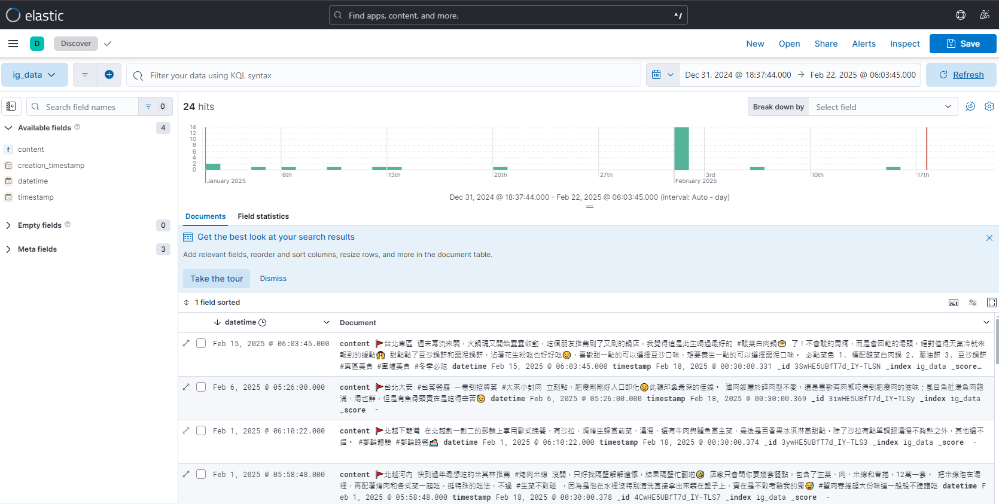

# 📌 InstaSearch - Elasticsearch + Python 全文檢索專案

## 🔥 簡介
InstaSearch 是一個基於 **Elasticsearch** 的全文檢索系統，提供 **Streamlit** 網站介面並進行文本搜索。此專案適用於學習 **Elasticsearch 搜索技術**，並提供Python API 來讀取和處理 IG 文章或其他文本數據。

---
### 網站介面


### 設定頁面(上傳IG資料檔)


### ElasticSearch示意資料(Kibana介面)

---

## 系統要求

- Docker 與 Docker Compose
- Git LFS (用於下載範例資料)

## 安裝與設定

### **1️⃣ 下載範例IG檔**
```bash
git lfs pull
```

### **2️⃣ 啟動所有服務**
使用 Docker Compose 啟動所有服務（Elasticsearch、Kibana、Streamlit）：
```bash
docker compose up -d
```

此命令會啟動：
- Elasticsearch (http://localhost:9200)
- Kibana (http://localhost:5601)
- Streamlit 應用程式 (http://localhost:8501)

### **3️⃣ 驗證服務狀態**

**檢查 Elasticsearch：**
```bash
curl http://localhost:9200
```

**檢查 Kibana：**
打開瀏覽器訪問： 👉 [http://localhost:5601](http://localhost:5601)

**檢查 Streamlit：**
打開瀏覽器訪問： 👉 [http://localhost:8501](http://localhost:8501)

---

## 使用方法

### **1️⃣ 資料處理**

專案包含一個完整的資料處理流程，用於處理 Instagram 資料的導入：

1. 將你的 Instagram 資料壓縮檔放在 `ig_data/` 目錄下
2. 系統會自動：
   - ✅ 解壓縮 Instagram 資料
   - ✅ 處理文章內容與媒體檔案
   - ✅ 建立 Elasticsearch 索引
   - ✅ 導入資料至 Elasticsearch
   - ✅ 自動整理媒體檔案至正確位置

### **2️⃣ 使用網站介面**
直接訪問 http://localhost:8501 即可使用搜尋功能

---

## 📌 專案結構
```bash
InstaSearch/
│── data/                      # 本機儲存 Elasticsearch 索引的目錄
│── ig_data/                   # Instagram資料目錄
│── media/                     # 媒體檔案存放目錄
│── docker-compose.yml         # Docker 設定文件
│── streamlit_app/            # Streamlit 應用程式目錄
│   ├── app.py               # Streamlit 應用程式主程式
│   ├── setup.py             # 資料處理腳本
│   └── Dockerfile          # Streamlit 容器設定
│── notebook/                 # ES資料新刪修notebook腳本
│── README.md                # 本文件
```

## ⚙️ 系統架構

1. **容器化服務**
   - Elasticsearch：資料儲存和搜尋引擎
   - Kibana：資料視覺化和管理介面
   - Streamlit：使用者介面和搜尋功能

2. **資料處理流程**
   - 檔案系統處理：自動處理跨容器的檔案操作
   - 智能路徑處理：確保媒體檔案路徑正確
   - 自動權限管理：確保容器間的檔案存取權限
   - Elasticsearch 整合：自動建立索引和導入資料

3. **搜尋功能**
   - 全文檢索
   - 時間範圍篩選
   - 媒體檔案預覽

---

## 🛠️ 常見問題

### **1️⃣ 服務無法啟動？**
檢查執行中的容器：
```bash
docker ps
```
重置並重啟服務：
```bash
docker compose down -v
docker compose up -d
```

### **2️⃣ 資料導入失敗？**
確認以下幾點：
- 檢查容器日誌：
  ```bash
  docker compose logs streamlit_search
  ```
- 確認 `ig_data` 目錄中有正確的 ZIP 檔案
- 檢查 `logs` 目錄下的錯誤日誌

### **3️⃣ 媒體檔案無法顯示？**
確認：
- 檢查容器掛載目錄的權限
- 確認檔案路徑格式是否正確（應為 /app/media/posts/[date]/[filename]）
- 重新執行資料處理流程

---

## 📢 聯絡作者
如果你有任何問題或改進建議，請聯絡 [你的 GitHub](https://github.com/yourname)！

🚀 **快來試試 Elasticsearch 的強大全文檢索功能吧！**
