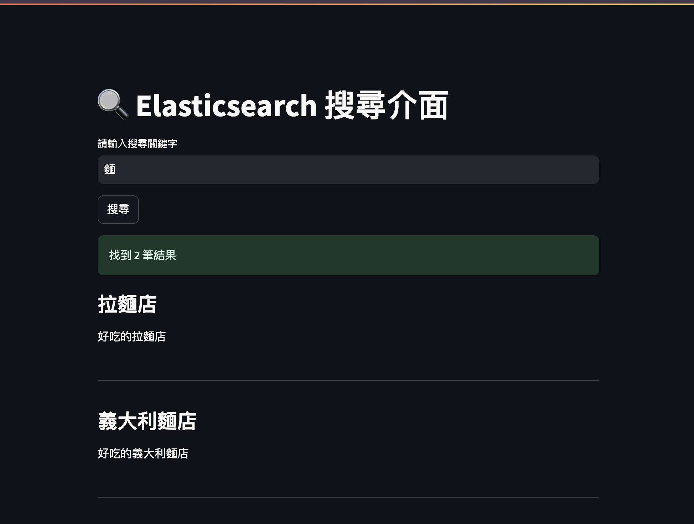
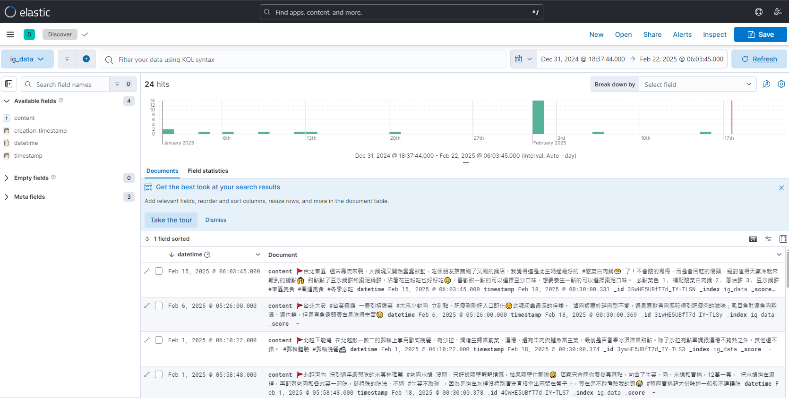

# 📌 InstaSearch - Elasticsearch + Python 全文檢索專案

## 🔥 簡介
InstaSearch 是一個基於 **Elasticsearch** 的全文檢索系統，提供 **Streamlit** 網站介面並進行文本搜索。此專案適用於學習 **Elasticsearch 搜索技術**，並提供Python API 來讀取和處理 IG 文章或其他文本數據。

---
### 網站介面

### ElasticSearch示意資料(Kibana介面)

---

## 安裝與設定

### **1️⃣ 安裝 Elasticsearch & Kibana**
**使用 Docker Compose 啟動服務：**
```bash
docker-compose up -d
```

## 下載範例IG檔(IG文章、影像、notebooks)
```bash
git lfs pull
```

**驗證 Elasticsearch 是否運行：**
```bash
curl http://localhost:9200
```

**驗證 Kibana 是否運行：**
打開瀏覽器並訪問： 👉 [http://localhost:5601](http://localhost:5601)

### **2️⃣ 安裝 Python Elasticsearch 客戶端**
```bash
pip install elasticsearch
```

### **3️⃣ 建立索引並插入測試文本**
```python
from elasticsearch import Elasticsearch
import datetime

# 連接 Elasticsearch
es = Elasticsearch("http://localhost:9200")

# 建立索引
index_name = "text_experiment"
if es.indices.exists(index=index_name):
    es.indices.delete(index=index_name)

es.indices.create(index=index_name, body={
    "settings": {"number_of_shards": 1, "number_of_replicas": 0},
    "mappings": {
        "properties": {
            "title": {"type": "text"},
            "content": {"type": "text"},
            "tags": {"type": "keyword"},
            "created_at": {"type": "date"}
        }
    }
})

# 插入測試文本
doc = {
    "title": "Elasticsearch 測試文檔",
    "content": "這是一個測試 Elasticsearch 插入與刪除文本的範例。",
    "tags": ["search", "test"],
    "created_at": datetime.datetime.now()
}
res = es.index(index=index_name, body=doc)
print(f"✅ 文本已寫入，ID: {res['_id']}")
```

### **4️⃣ 搜索文本**
```python
query = {"query": {"match": {"content": "測試"}}}
response = es.search(index=index_name, body=query)
for hit in response["hits"]["hits"]:
    print(f"📄 {hit['_source']['title']} (ID: {hit['_id']})")
```

### **5️⃣ 刪除索引**
```python
es.indices.delete(index=index_name)
print(f"🗑️ 索引 '{index_name}' 已刪除")
```

---

## 📌 專案結構
```bash
InstaSearch/
│── data/                      # 本機儲存 Elasticsearch 索引的目錄
│── docker-compose.yml         # Docker 設定文件
│── streamlit_app/             # Python 程式碼目錄
│── notebook/                  # ES資料新刪修notebook腳本
│── README.md                  # 本文件
```

---

## 🛠️ 常見問題
### **1️⃣ Elasticsearch/Kibana 無法啟動？**
請檢查是否有其他 Elasticsearch 執行中：
```bash
docker ps | grep elasticsearch
```
如果有舊的容器，請先刪除：
```bash
docker-compose down -v
```
然後重新啟動：
```bash
docker-compose up -d
```

---

## 📢 聯絡作者
如果你有任何問題或改進建議，請聯絡 [你的 GitHub](https://github.com/yourname)！

🚀 **快來試試 Elasticsearch 的強大全文檢索功能吧！**
