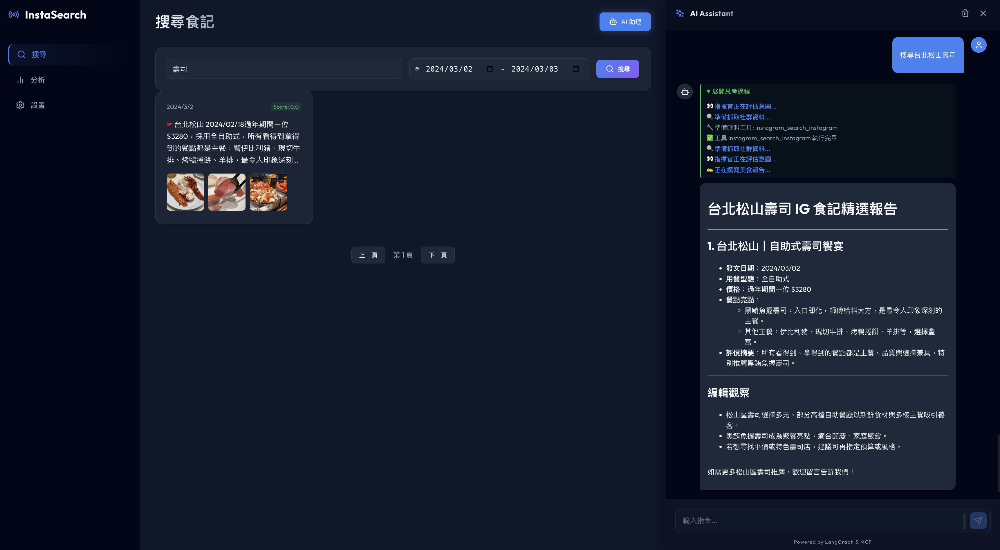
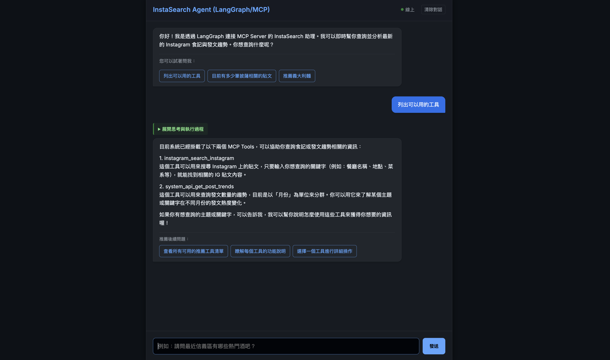
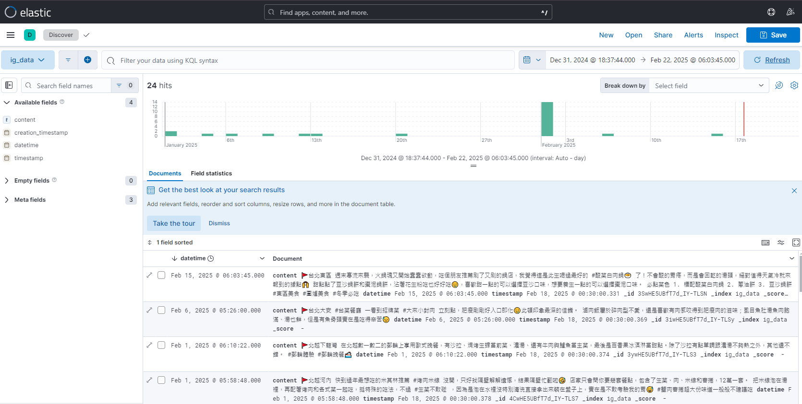

# InstaSearch - AI 全文檢索與分析平台

[](https://vuejs.org/)
[](https://fastapi.tiangolo.com/)
[](https://www.elastic.co/)
[](https://www.docker.com/)

InstaSearch 是一個整合 **Elasticsearch** 全文檢索與 **LangGraph** 多代理架構的系統，用於 Instagram 食記資料的搜尋與 AI 助理分析。

---

## 🖼️ 介面展示


*搜尋頁面介面：左側為搜尋結果，右側為可縮放的 AI Agent 側邊欄。*


*Agent 執行狀態：基於 SSE 串流展示推理過程、工具呼叫與建議後續指令。*


*詳情彈窗：1:3 佈局（文字：圖片），支援雙欄圖片網格與 Markdown 內容解析。*


*後端檢索邏輯：基於 Elasticsearch 實作精確與全文關鍵字搜尋。*

---

## 🛠️ 技術架構

### 1. 代理運作邏輯 (LangGraph)
- **多代理架構 (Supervisor-Worker)**：由主管節點 (Supervisor) 評估使用者意圖，分發任務至 `retriever` (查尋)、`reporter` (總結) 或 `info_agent` (系統說明)。
- **持久化記憶 (Persistence)**：導入 `MemorySaver` 檢查點機制，支援單次連線內的多對話脈絡保存。
- **自動修正 (Reflector)**：內建反射節點，偵測工具執行錯誤時自動優化搜尋參數並重試。
- **訊息修剪 (Pruning)**：自動過濾冗餘工具日誌，優化 Token 損耗。

### 2. 資料交互 (MCP & SSE)
- **Model Context Protocol (MCP)**：透過 MCP Server 標準化串接外部搜尋工具。
- **Server-Sent Events (SSE)**：後端非同步流式輸出 Agent 的思考狀態與 `ui_command` 自動化指令。

### 3. 前端技術棧
- **佈局管理**：Vue 3 Composition API + Pinia 狀態管理（管理側邊欄開關、搜尋載入狀態）。
- **樣式設計**：Vanilla CSS 實作玻璃擬態 (Glassmorphism)，支援 RWD 響應式佈局與單一頁面動態縮放。

---

## 📂 專案結構

```bash
InstaSearch/
│── backend/                # FastAPI 服務與 LangGraph 邏輯
│   ├── routers/            # SSE 串流與 API 路由 (chat, search, analysis)
│   ├── agent.py            # LangGraph 節點與圖表定義 (Supervisor/Reflector)
│   └── Dockerfile
│
│── frontend/               # Vue.js 前端應用
│   ├── src/
│   │   ├── components/     # AgentChat, AgentSidebar, PostModal
│   │   ├── stores/         # UI 狀態管理 (ui.js)
│   │   └── views/          # 核心視圖 (Search.vue)
│   └── Dockerfile
│
│── ig_data/                # 原始 JSON 資料與圖片存放
│── data/                   # Elasticsearch 資料持久化目錄
│── imgs/                   # README 展示圖檔
│── docker-compose.yml      # 服務編排設定
└── README.md
```

---

## 🚀 部署與啟動

### 前置需求
- 安裝 Docker 與 Docker Compose。
- 於 `env/app.env` 配置 Azure OpenAI 相關變數：
  - `AZURE_OPENAI_API_KEY`
  - `AZURE_OPENAI_ENDPOINT`
  - `AZURE_DEPLOYMENT_NAME`

### 啟動服務
```bash
docker-compose up --build
```
- **主要路徑**: [http://localhost:3000](http://localhost:3000)
- **API 文件**: [http://localhost:8000/docs](http://localhost:8000/docs)
