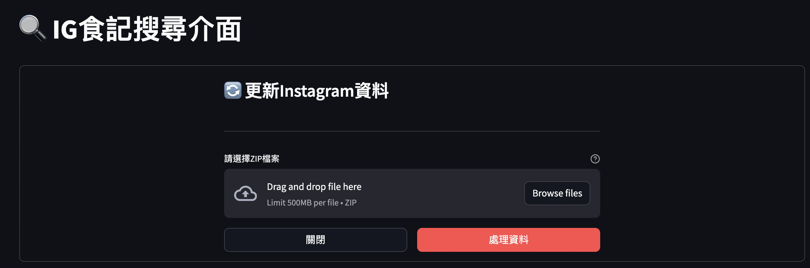

# 📌 InstaSearch - Elasticsearch + Python 全文檢索專案

## 🔥 簡介
InstaSearch 是一個基於 **Elasticsearch** 的全文檢索系統，提供 **Streamlit** 網站介面並進行文本搜索。此專案適用於學習 **Elasticsearch 搜索技術**，並提供Python API 來讀取和處理 IG 文章或其他文本數據。

---
### 網站介面

### ElasticSearch示意資料(Kibana介面)

---

## 系統要求

- Python 3.7+
- Docker 與 Docker Compose
- Git LFS (用於下載範例資料)

## 安裝與設定

### **1️⃣ 安裝 Elasticsearch & Kibana**
**使用 Docker Compose 啟動服務：**
```bash
docker-compose up -d
```

### **2️⃣ 下載範例IG檔**
```bash
git lfs pull
```

### **3️⃣ 驗證服務狀態**

**檢查 Elasticsearch：**
```bash
curl http://localhost:9200
```

**檢查 Kibana：**
打開瀏覽器訪問： 👉 [http://localhost:5601](http://localhost:5601)

### **4️⃣ 安裝相依套件**
```bash
pip install elasticsearch pandas
```

---

## 使用方法

### **1️⃣ 資料初始化**

專案包含一個強大的`setup.py`腳本，用於處理Instagram資料的導入：

1. 將你的Instagram資料壓縮檔放在`ig_data/`目錄下
2. 執行初始化腳本：
```bash
python setup.py
```

此腳本會自動：
- ✅ 解壓縮Instagram資料
- ✅ 處理文章內容與媒體檔案
- ✅ 建立Elasticsearch索引
- ✅ 導入資料至Elasticsearch
- ✅ 自動整理媒體檔案至正確位置

### **2️⃣ 啟動網站介面**
```bash
cd streamlit_app
streamlit run app.py
```

---

## 📌 專案結構
```bash
InstaSearch/
│── data/                      # 本機儲存 Elasticsearch 索引的目錄
│── ig_data/                   # Instagram資料目錄
│── media/                     # 媒體檔案存放目錄
│── docker-compose.yml         # Docker 設定文件
│── setup.py                   # 資料初始化腳本
│── streamlit_app/            # Python 程式碼目錄
│   └── app.py               # Streamlit應用程式
│── notebook/                 # ES資料新刪修notebook腳本
│── README.md                # 本文件
```

## ⚙️ 系統架構

1. **資料處理流程**
   - 解壓縮Instagram資料
   - 處理JSON格式的貼文資料
   - 整理媒體檔案
   - 建立Elasticsearch索引
   - 導入處理後的資料

2. **搜尋功能**
   - 全文檢索
   - 時間範圍篩選
   - 媒體檔案預覽

---

## 🛠️ 常見問題

### **1️⃣ Elasticsearch/Kibana 無法啟動？**
檢查執行中的容器：
```bash
docker ps | grep elasticsearch
```
重置並重啟服務：
```bash
docker-compose down -v
docker-compose up -d
```

### **2️⃣ 資料導入失敗？**
確認以下幾點：
- Elasticsearch是否正常運行
- Instagram資料壓縮檔是否放在正確位置
- 檢查logs目錄下的錯誤日誌

### **3️⃣ 媒體檔案無法顯示？**
確認：
- media目錄存在且有適當的讀取權限
- 檢查檔案路徑是否正確
- 確認檔案格式是否支援

---

## 📢 聯絡作者
如果你有任何問題或改進建議，請聯絡 [你的 GitHub](https://github.com/yourname)！

🚀 **快來試試 Elasticsearch 的強大全文檢索功能吧！**
